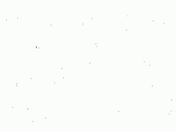
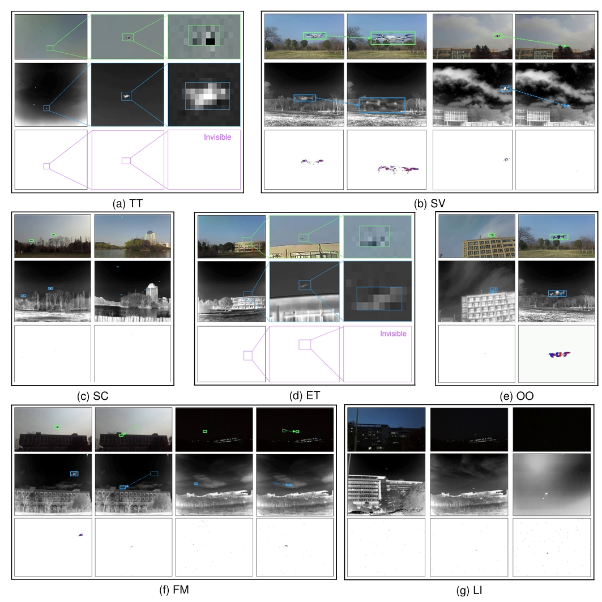
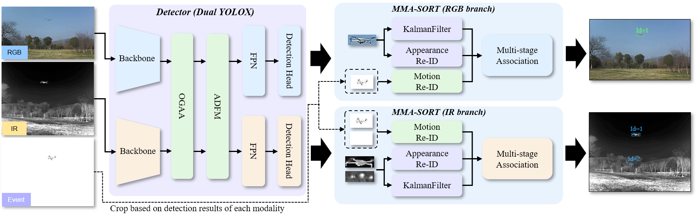
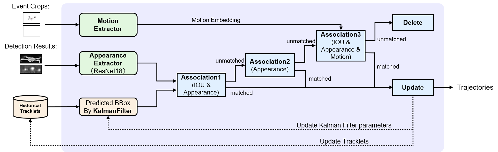
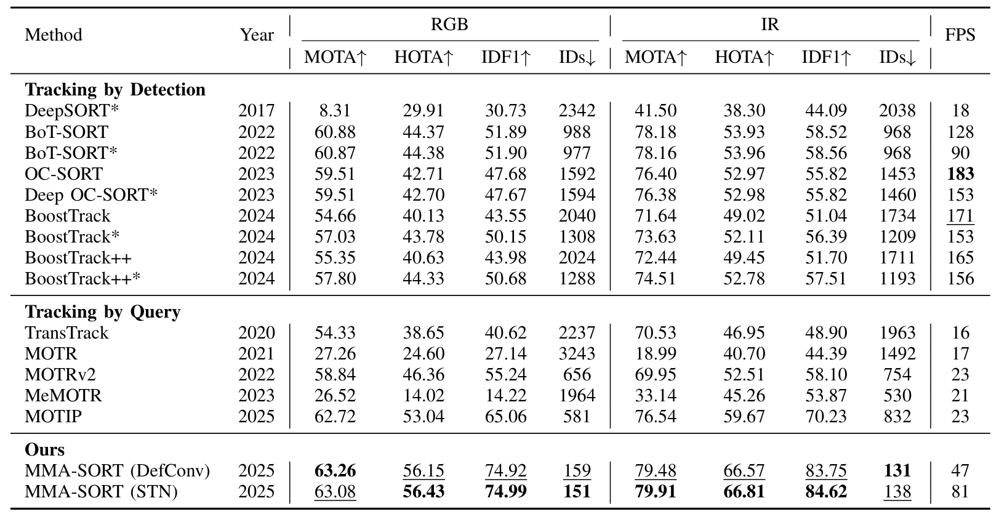

# **MM-UAV Benchmark**  

------

## A Tri-Modal Dataset and a Baseline System for Tracking Unmanned Aerial Vehicles

------

### **MM-UAV** is the first large-scale tri-modal benchmark dataset for anti-UAV applications. This dataset contains 1,301 sequences (1,200 for training, 121 for testing), covering three modalities (RGB + Infrared + Event Data). Each modality includes approximately 2.8 million image frames.**🔗 [Benchmark page](https://xuefeng-zhu5.github.io/MM-UAV/).**


<div class="table-container">
  <table class="equal-height-table">
  <tr>
    <td style="font-weight: bold; width: 37%;">RGB</td>
    <td style="font-weight: bold; width: 33%;">IR</td>
    <td style="font-weight: bold; width: 30%;">Event</td>
  </tr>

  <tr>
    <td>
      <div class="equal-height-img-container">
        
      </div>
    </td>
    <td>
      <div class="equal-height-img-container">
        
      </div>
    </td>
    <td>
      <div class="equal-height-img-container">
        
      </div>
    </td>
  </tr>

  <tr>
    <td>
      <div class="equal-height-img-container">
        
      </div>
    </td>
    <td>
      <div class="equal-height-img-container">
        
      </div>
    </td>
    <td>
      <div class="equal-height-img-container">
        
      </div>
    </td>
  </tr>

  <tr>
    <td>
      <div class="equal-height-img-container">
        
      </div>
    </td>
    <td>
      <div class="equal-height-img-container">
        
      </div>
    </td>
    <td>
      <div class="equal-height-img-container">
        
      </div>
    </td>
  </tr>

  <tr>
    <td>
      <div class="equal-height-img-container">
        
      </div>
    </td>
    <td>
      <div class="equal-height-img-container">
        
      </div>
    </td>
    <td>
      <div class="equal-height-img-container">
        
      </div>
    </td>
  </tr>

  <tr>
    <td>
      <div class="equal-height-img-container">
        
      </div>
    </td>
    <td>
      <div class="equal-height-img-container">
        
      </div>
    </td>
    <td>
      <div class="equal-height-img-container">
        
      </div>
    </td>
  </tr>

  <tr>
    <td>
      <div class="equal-height-img-container">
        
      </div>
    </td>
    <td>
      <div class="equal-height-img-container">
        
      </div>
    </td>
    <td>
      <div class="equal-height-img-container">
        
      </div>
    </td>
  </tr>

  <tr>
    <td>
      <div class="equal-height-img-container">
        
      </div>
    </td>
    <td>
      <div class="equal-height-img-container">
        
      </div>
    </td>
    <td>
      <div class="equal-height-img-container">
        
      </div>
    </td>
  </tr>

  <tr>
    <td>
      <div class="equal-height-img-container">
        
      </div>
    </td>
    <td>
      <div class="equal-height-img-container">
        
      </div>
    </td>
    <td>
      <div class="equal-height-img-container">
        
      </div>
    </td>
  </tr>

</table>
</div>

------

### Dataset example

<p align="center"></p>

### chalenges

<p align="center"></p>

#### 🔗 **Download Link**: [coming soon](https://pan.baidu.com)  

#### 📦 **Extracted Size**: ~400 GB  

#### **🔗Raw results and evaluation tool** is in [MM-UAV-Evaluation-ToolKit](https://github.com/JJGU2291/MM-UAV-Evaluation-ToolKit/tree/main).


---

## **Directory Structure**

```
MM-UAV/
├── train/
│   └── 0001/
│       ├── rgb_frame/
│       │   ├── 0001.jpg
│       │   └── ...
│       ├── ir_frame/
│       │   ├── 0001.jpg
│       │   └── ...
│       ├── event_frame/
│       │   ├── 0001.jpg
│       │   └── ...
│       ├── gt_ir/
│       │   └── gt.txt
│       ├── gt_rgb/
│       │   └── gt.txt
│       ├── sot_groundtruth/
│       │   ├── rgb_frame/
│       │   │   ├── groundtruth_01.txt
│       │   │   └── ...
│       │   ├── ir_frame/
│       │   │   ├── groundtruth_01.txt
│       │   │   └── ...
│       │   └── ...
│       ├── seqinfo-rgb.ini
│       └── seqinfo-ir.ini
```

#### This dataset follows the MOT (multi-object tracking) format and is primarily designed for multi-modal multi-object tracking tasks. Additionally, we provide single-object ground truth under `sot_groundtruth/` to ensure compatibility with single object tracking methods.

---

# **MMA-SORT**  

#### MMA-SORT serves as the baseline method for the MM-UAV dataset. It incorporates an additional alignment and fusion module into the YOLOX detector to achieve cross-modal spatial alignment and fusion. For tracking, it leverages the Event modality to enable more accurate identity association.

<p align="center"></p>

### 1. Environment Setup

Follows the original BoT-SORT setup.

**Step 1.** Create a Conda environment and install PyTorch.

```shell
conda create -n botsort python=3.7
conda activate botsort
```

**Step 2.** Install PyTorch and the corresponding torchvision from [pytorch.org](https://pytorch.org/get-started/locally/).  
The code was tested using `torch==1.11.0+cu113` and `torchvision==0.12.0`.

**Step 3.** Install BoT-SORT.

```shell
pip3 install -r requirements.txt
python3 setup.py develop
```

**Step 4.** Install [pycocotools](https://github.com/cocodataset/cocoapi).

```shell
pip3 install cython
pip3 install pycocotools
```

**Step 5.** Install other dependencies.

```shell
# Cython-bbox
pip3 install cython_bbox

# (Optional)
pip3 install faiss-cpu
# or
pip3 install faiss-gpu
```

### 2. Data Preparation

**Step 1.** Download the MM-UAV dataset.

🔗 **Download Link**: [coming soon](https://pan.baidu.com)  
📦 **Extracted Size**: ~400 GB  

**Step 2.** Convert the MOT dataset to COCO format.

Modify the dataset path `DATA_PATH = "path/to/MMMUAV"` in the script and run the conversion script:
```bash
python tools/datasets/convert_MMMUAV_to_coco.py
```

This script will generate COCO-format annotation files (`train-rgb.json`, `train-ir.json`, `val-rgb.json`, `val-ir.json`) under `DATA_PATH/annotations/`, which will be used for subsequent YOLO training.

### 3. Training the Detector

You can follow the 2-stage training process below, or directly download the pre-trained weights used in the paper ([pretrained weights](https://drive.google.com/drive/folders/1MaQk8MA_63wHam6Bwr44NYHIg4pPl1qd?usp=drive_link)) and place them into the corresponding directories:

- `./YOLOX_outputs/yolox_s_2_stream_def_tuning_fusion_head/best_ckpt.pth.tar`
- `./YOLOX_outputs/yolox_s_2_stream_stn_tuning_fusion_head/best_ckpt.pth.tar`

- **Step 1.** Train the two-stream YOLOX.

  ```bash
  bash ./train_yolox_2_stream.sh
  ```

  This will generate `best_ckpt.pth.tar` under `./YOLOX_outputs/yolox_s_2_stream/`.

- **Step 2.** Based on the weights from Step 1, train YOLOX with the alignment and fusion module.

  ```bash
  bash ./train_yolox_2_stream_def.sh   # Deformable alignment version
  # or
  bash ./train_yolox_2_stream_stn.sh   # Spatial Transformer Network version
  ```

### 4. Running MMA-SORT

<p align="center"></p>

The Python code for the tracker corresponds to `tracker/ma_sort_event.py` (RGB branch) and `tracker/ma_sort_event2.py` (IR branch).

**Step 1.** Download the pre-trained UAV ReID model ([pretrained weights](https://drive.google.com/drive/folders/1MaQk8MA_63wHam6Bwr44NYHIg4pPl1qd?usp=drive_link)) (Alternatively, you can retrain it yourself using FastReID) and place them into:

- `./pretrained/multi_uav-rgb.t7`
- `./pretrained/multi_uav-ir.t7`

**Step 2.** Execute the final tracking script:

```bash
bash ./script/final_def.sh   # Deformable version
# or
bash ./script/final_stn.sh   # STN version
```

After inference, the tracking results (`track_results_rgb/` and `track_results_ir/`) will be saved under `./YOLOX_outputs/your_experiments/`.

**Step 3.** Evaluate the tracking results:


##### Raw results and evaluation tool is in [MM-UAV-Evaluation-ToolKit](https://github.com/JJGU2291/MM-UAV-Evaluation-ToolKit/tree/main).
<p align="center"></p>

<p align="center"></p>

## Citation

```bibtex
@article{,
  title={},
  author={},
  journal={},
  year={2025}
}
```

## Acknowledgement

A significant portion of the code is borrowed from [YOLOX](https://github.com/Megvii-BaseDetection/YOLOX) and [BoT-SORT](https://github.com/NirAharon/BoT-SORT).  
We thank the authors for their excellent work!